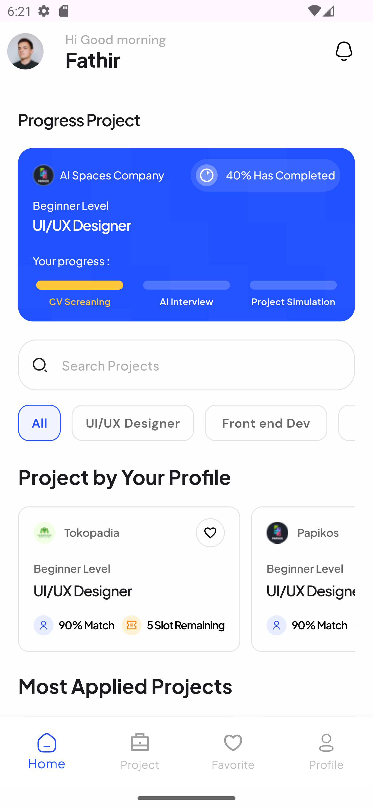
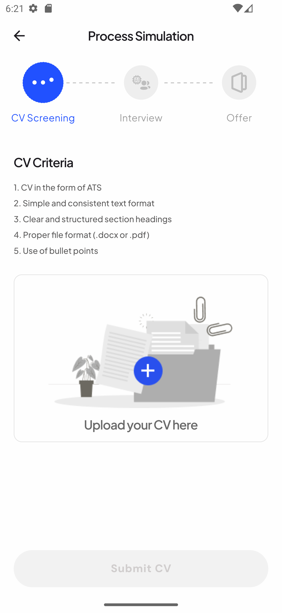

# DOCUMENTATION BACKEND IMPROOVE

This project describes the backend documentation of the improved application according to the business processes we are developing!

## List of Content
- [About the Project](#tentang-proyek)
- [Feauture](#fitur)
- [Installation](#instalasi)
  
## **About the Project**
## IMPROOVE

[](http://www.youtube.com/watch?v=NkSRFEQb94A)

This idea was made from our anxiety about the unemployment rate in Indonesia which reached 5.45%, making Indonesia the country with the second highest average unemployment in ASEAN. Challenges in the labor market can be seen when BPS reports that in 2023 there are 1,819,830 million people who are still looking for work. However, only a few of them manage to get a job that meets their expectations. This is an important indicator in the context of achieving sustainable development target (SDGs) number 8, which is related to decent work and economic growth.

This unemployment occurs mostly among high school and vocational school graduates, with the Open Unemployment Rate (TPT) at 8.41% of the total TPT in February 2023. This shows that many graduates from the secondary education level are not absorbed in the job market because they lack the relevant portfolios or skills required by the industry. Unemployment at the higher education level is also quite significant, with TPT at 5.59%. Despite having a degree, many graduates may not have the relevant portfolio or experience to meet the requirements of the job they are applying for. We found that the cause of job seekers' failure to get a job is failure in job interviews and CV making that is lacking or even not in accordance with industry regulations. Failure in job interviews is a major obstacle for job seekers, especially recent graduates who do not have much experience. Lack of preparation, such as knowledge of the company or position being applied for, as well as weak communication and body language skills, are some of the contributing factors. Making a CV that is not in accordance with industry regulations can also make job seekers fail in the administrative selection. In addition, problems related to the skill capabilities of new graduates are also a problem because of confusion in making projects that suit the needs of the current industry.

We created a digital platform in the form of a mobile application that we named "IMPROOVE". The name Improove was taken because it means "Improving," where on this platform users will improve the quality of both in making CVs to comply with industry regulations, increasing readiness to face job interviews, and improving skills by working on real project simulations according to industry needs.

"Increase Capability, Get Job Easily"

## **Feauture**

- Apply Project
- Check Cover Letter by AI
- Check Your Simulated Interview

## Installation

Clone this project

```bash
https://github.com/ardhiancalwa/e-connect.git
```
Get depedency

```bash
flutter pub get
```

Run this project

```bash
flutter run
```

Demo Account

```bash
Email : admin@gmail.com
Password : 123123
```

Front end Documentation







